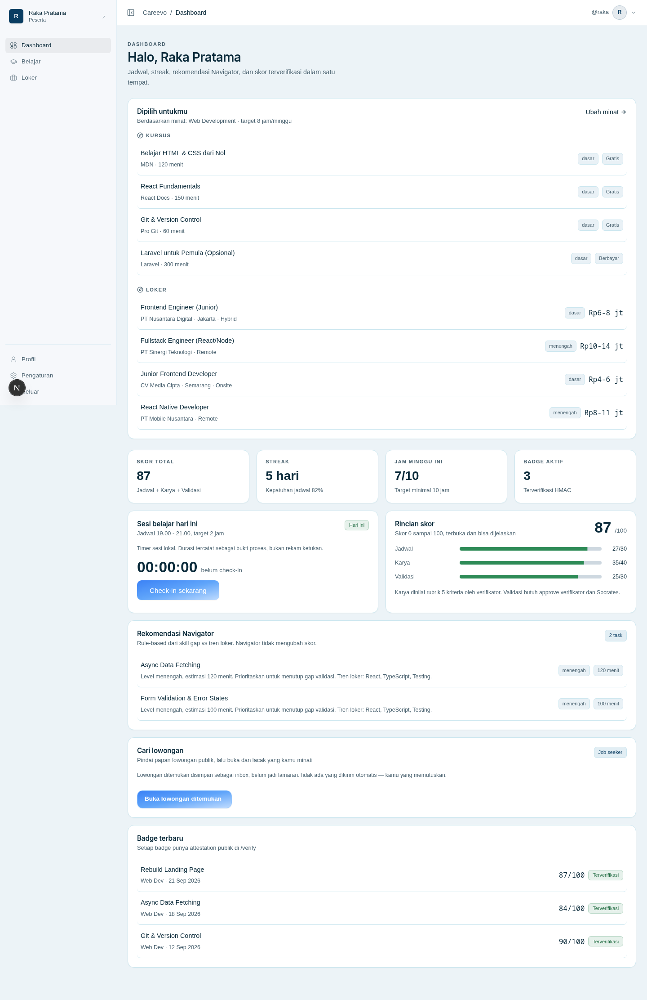
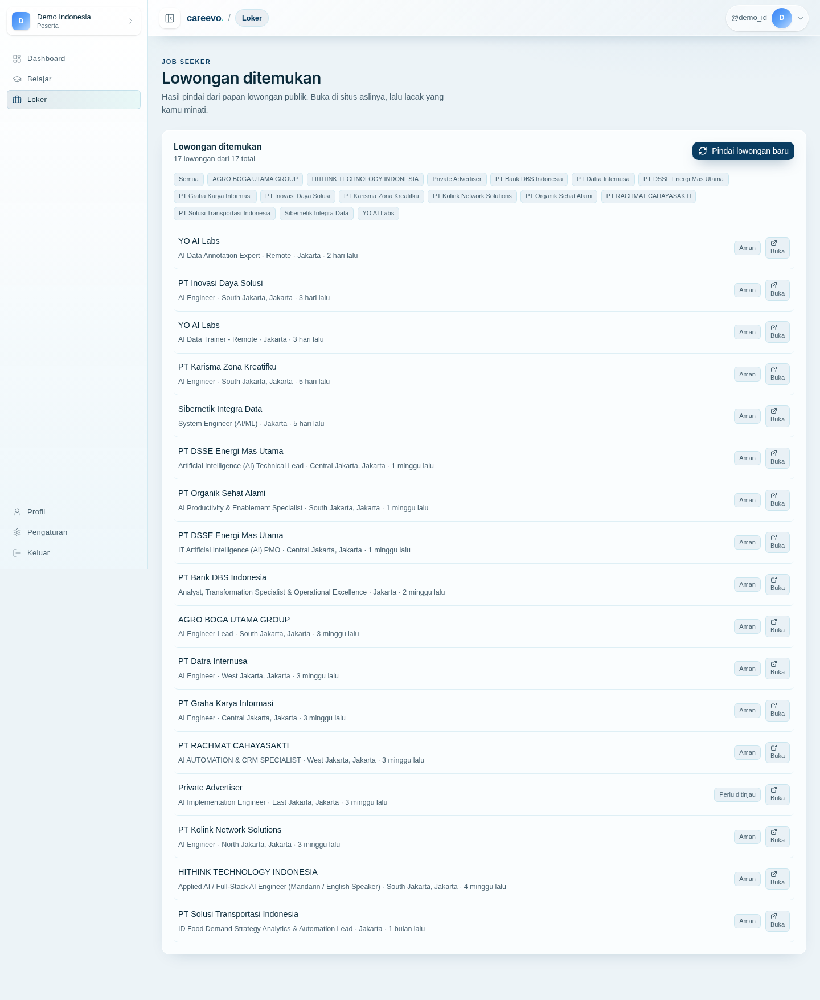
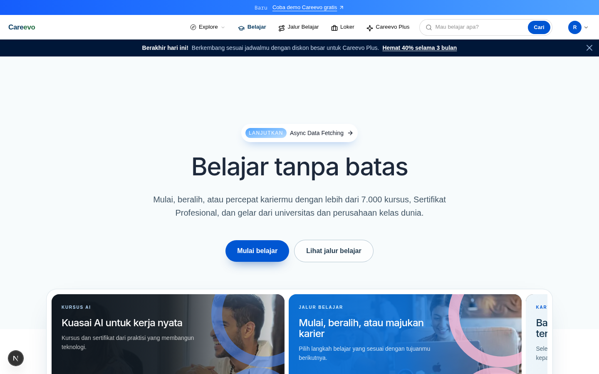

<div align="center">
  

  # Learn. Verify. Earn.

  **Jembatan belajar-ke-kerja untuk membangun kompetensi, membuktikan proses, dan menemukan peluang dengan lebih percaya diri.**

  <p>
    <a href="https://careevo.my.id/">🌐 Coba Careevo</a>
    ·
    <a href="#quickstart">🚀 Jalankan lokal</a>
    ·
    <a href="#dokumentasi">📚 Baca dokumentasi</a>
  </p>

  <p>
    <strong>Next.js 16</strong> · <strong>React 19</strong> · <strong>PostgreSQL</strong> · <strong>Drizzle ORM</strong> · <strong>Status: MVP</strong>
  </p>
</div>

---

## Careevo dalam 10 detik

Careevo menghubungkan **belajar**, **bukti kompetensi**, dan **peluang kerja** dalam satu alur. Pengguna dapat menyelesaikan kursus dan kuis, membangun learning evidence, mengirimkan pekerjaan untuk direview, memperoleh attestation yang dapat diverifikasi publik, serta menelusuri lowongan kerja dengan sinyal kepercayaan yang lebih transparan.

Aplikasi ini masih berupa **MVP/prototipe aktif**. Sebagian domain sudah memakai PostgreSQL sebagai sumber kebenaran, sementara kursus, kuis, resume, dan data operasional tertentu masih menggunakan penyimpanan file lokal atau fixture. README ini membedakan kemampuan yang sudah ada dari keputusan production yang masih direncanakan.

## Tiga pilar

<table>
  <tr>
    <td width="33%" valign="top">
      <h3>📖 Learn</h3>
      Kursus, modul, materi, kuis, jalur belajar, latihan, dan mastery yang membantu pengguna bergerak dari tujuan karier ke rencana belajar.
    </td>
    <td width="33%" valign="top">
      <h3>✓ Verify</h3>
      Assessment server-side, review terkontrol, audit trail, dan attestation HMAC yang dapat diperiksa melalui halaman publik.
    </td>
    <td width="33%" valign="top">
      <h3>💼 Earn</h3>
      Profil, resume, rekomendasi, dan inbox lowongan kerja dengan audit Sentinel agar pengguna dapat mengambil keputusan dengan informasi yang lebih baik.
    </td>
  </tr>
</table>

## Bukti visual

Dashboard Careevo menyatukan rekomendasi kursus, lowongan, sesi belajar, skor, dan badge terverifikasi dalam satu ruang kerja:

<p align="center">
  <a href="docs/shots/02-dashboard.png">
    
  </a>
</p>

<p align="center"><em>Contoh dashboard learner — aset visual repository.</em></p>

<details>
<summary><strong>Lihat contoh alur lain</strong></summary>

### Audit lowongan

<a href="docs/shots/13-inbox-fraud-verdict.png">
  
</a>

### Halaman belajar

<a href="belajar-promo-bars-desktop.png">
  
</a>

</details>

## Fitur utama

| Area | Yang tersedia |
|---|---|
| **Pembelajaran** | Katalog kursus, modul, materi video/PDF, halaman prosa berbasis blok terstruktur, kuis, jalur belajar, latihan, dan mastery. |
| **Bukti belajar** | Attempt kuis yang dibuka serta dinilai di server, immutable assessment snapshot, progress modul, learning run, dashboard performa, dan kebijakan sesi belajar. |
| **Review & attestation** | Submission, state machine review, authorization server-side, audit event, attestation HMAC-SHA256, status active/revoked, dan token verifikasi publik. |
| **Loker** | Inbox lowongan, filter, rekomendasi kursus, dan audit deterministik Sentinel dengan verdict yang diturunkan saat data dibaca. |
| **Profil** | Onboarding berbasis tujuan, profil publik, resume bergaya LinkedIn, pengalaman, proyek, pendidikan, keahlian, sertifikasi, serta CV/portofolio PDF. |
| **AI opsional** | Evaluasi dan rekomendasi on-demand melalui Gemini; tanpa `GEMINI_API_KEY`, aplikasi dasar tetap dapat dijalankan. |

### Yang membuat pendekatannya berbeda

- **Browser bukan sumber kebenaran.** Score, eligibility, role, completion, dan payload credential dibangun atau diverifikasi di server.
- **Assessment adalah snapshot.** Kuis yang sedang dikerjakan tidak berubah hanya karena bank kuis diedit setelah attempt dimulai.
- **Verdict tidak dipalsukan.** Jika data lowongan tidak cukup, sistem dapat menampilkan `Belum diperiksa` atau `Perlu ditinjau`, bukan memaksa kesimpulan `Aman`.
- **Konten tetap terstruktur.** Halaman disimpan sebagai blok data, bukan HTML mentah yang dirender dengan `dangerouslySetInnerHTML`.

## Alur produk

```text
Onboarding
    ↓
Tujuan karier → Jalur belajar → Kursus / modul / kuis
                                      ↓
                             Learning evidence
                                      ↓
                              Submission & review
                                      ↓
                       Attestation → Verifikasi publik
                                      ↓
                       Rekomendasi → Peluang kerja
```

### Route penting

- `/` — halaman marketing.
- `/masuk`, `/daftar`, `/onboarding` — autentikasi dan onboarding.
- `/belajar`, `/belajar/[slug]`, `/belajar/jalur` — katalog dan jalur belajar.
- `/dashboard`, `/profil`, `/p/[username]` — dashboard dan profil publik.
- `/loker`, `/loker/inbox` — pencarian dan inbox lowongan.
- `/submission`, `/review`, `/performa`, `/audit` — submission, review, dan area verifikator.
- `/verify/[token]` — verifikasi attestation publik.
- `/ai-mastery` — aplikasi AI Mastery yang dibingkai di Careevo.

## Arsitektur

```text
Server Component / Server Action / Route Handler
                         │
                         ▼
       Principal + authorization + validasi Zod
                         │
                         ▼
                  Application service
                         │
                         ▼
              Repository + transaksi PostgreSQL
                         │
                ┌────────┴────────┐
                ▼                 ▼
           Audit event     Transactional outbox
                                    │
                                    ▼
                         Worker + sink idempoten
```

Prinsip yang harus dipertahankan saat mengubah kode:

- PostgreSQL adalah sumber kebenaran untuk identity, RBAC, session, audit, outbox, learning evidence, review, dan attestation yang sudah dimigrasikan.
- `modulUntuk()` dan `modulUntukSumber()` di `src/lib/courses/modul-resolver.ts` adalah resolver modul tunggal untuk data stored/derived.
- `src/lib/courses/{kurikulum,blok,halaman,kuis}.ts` sengaja client-safe dan tidak boleh menarik dependency database atau filesystem.
- Review menggunakan state machine; penerbitan attestation tidak boleh berasal dari klaim score atau identitas yang dikirim browser.
- Outbox memberi jaminan transaksi dan deduplikasi pada sink internal tertentu, tetapi **exactly-once untuk semua sink eksternal tidak dijanjikan**.

Topologi production pada [ADR 0001](docs/adr/0001-topologi-deployment-produksi.md) dan pilihan database/ORM pada [ADR 0002](docs/adr/0002-database-orm-postgres.md) masih berstatus **diusulkan**. Jangan menganggap Vercel, VPS, provider queue, object storage, region, atau keputusan operasional lain sudah final hanya karena tercantum di dokumen rencana.

## Tech stack

| Lapisan | Teknologi |
|---|---|
| Web | Next.js `16.3.5`, React `19.2.8`, TypeScript, App Router |
| UI | Tailwind CSS v4, Radix primitives, Lucide, Motion |
| Data | PostgreSQL, Drizzle ORM `0.45.x`, Drizzle Kit |
| Validasi | Zod |
| AI opsional | `@google/genai` / Gemini |
| Test & quality | Vitest `5.0.1`, ESLint `9`, TypeScript compiler |
| Runtime | Node.js `^22.12.0`, `^24.0.0`, atau `>=26.0.0` |

## Quickstart

Jalur tercepat untuk menjalankan aplikasi utama secara lokal:

```bash
# 1. Clone dan masuk ke repository
git clone https://github.com/vaskoyudha/careevo.git
cd careevo

# 2. Instal dependency
npm ci

# 3. Nyalakan PostgreSQL lokal lalu terapkan schema
docker compose up -d postgres
npm run db:migrate

# 4. Jalankan Careevo
npm run dev
```

Buka [http://localhost:3000](http://localhost:3000). Jika Docker tidak tersedia, gunakan PostgreSQL native dan ikuti [runbook database lokal](docs/local-db.md).

> **Catatan:** kredensial PostgreSQL di `docker-compose.yml` adalah kredensial development yang sengaja dipublikasikan. Jangan gunakan `careevo_dev` untuk deployment publik.

### Environment lokal

```bash
cp .env.example .env.local
```

Untuk development dasar, fallback yang sudah terdokumentasi dapat digunakan. Untuk environment production, `SESSION_SECRET`, `ATTESTATION_SECRET`, dan `DATABASE_URL` wajib dikonfigurasi dengan nilai yang valid. Jangan commit `.env.local` atau secret apa pun.

Variabel opsional yang umum:

- `GEMINI_API_KEY` — evaluasi AI on-demand.
- `DEMO_MODE=1` — akun demo lokal, hanya bersama `NODE_ENV=development`.
- `AI_MASTERY_API_URL` — biasanya `http://127.0.0.1:8011`.
- `AI_MASTERY_WEB_URL` — basis URL aplikasi web yang dibingkai di `/ai-mastery`.
- `UPSTASH_REDIS_REST_URL` dan `UPSTASH_REDIS_REST_TOKEN` — rate limit shared production.

## Perintah pengembangan

| Perintah | Kegunaan | Membutuhkan |
|---|---|---|
| `npm run dev` | Server development Turbopack | — |
| `npm run build` | Build production Next.js | — |
| `npm start` | Menyajikan hasil `.next` | `npm run build` lebih dahulu |
| `npm run typecheck` | `tsc --noEmit` | — |
| `npm run lint` | ESLint | — |
| `npm test` | Unit test Vitest | — |
| `npm run test:db` | Integration test database ephemeral | PostgreSQL + izin `CREATEDB` |
| `npm run check` | Typecheck → lint → skills check → unit test | — |
| `npm run db:generate` | Menghasilkan SQL migrasi | — |
| `npm run db:migrate` | Menerapkan migrasi | PostgreSQL |
| `npm run worker` | Menjalankan outbox worker | PostgreSQL |
| `npm run outbox:replay` | Melihat/replay dead-letter event | PostgreSQL + actor admin |
| `npm run smoke -- <baseUrl>` | Smoke test HTTP | Server aktif |
| `npm run e2e:onboarding -- <baseUrl>` | E2E onboarding | Server aktif |

> `npm run check` **tidak** menjalankan `npm run build` dan `npm run test:db`. Jalankan keduanya terpisah bila ingin memeriksa boundary client/server dan schema database.

### Akun demo dan admin pertama

Akun demo hanya tersedia dengan opt-in development:

```bash
NODE_ENV=development DEMO_MODE=1 npm run dev
```

Detail akun ada di `src/lib/auth/demo-accounts.ts`. Password demo bersifat publik dan tidak boleh dipakai pada deployment yang dapat diakses umum.

Database baru tidak memiliki admin otomatis. Setelah user mendaftar dan identitasnya diverifikasi operator di luar aplikasi:

```bash
npx tsx scripts/bootstrap-admin.ts --list-candidates
npx tsx scripts/bootstrap-admin.ts admin@contoh.test
```

Baca [docs/local-db.md](docs/local-db.md) sebelum menjalankan operasi operator atau reset database.

## Penyimpanan data

Careevo belum memakai satu storage untuk semua domain. Pemisahan ini disengaja selama migrasi bertahap:

| Storage | Isi | Konsekuensi |
|---|---|---|
| PostgreSQL + Drizzle | Identity, RBAC, session, audit, outbox, learning evidence, assessment, review, badge, attestation | Sumber kebenaran domain yang sudah dimigrasikan |
| `data/courses.json` + `data/kuis.json` | Kursus, modul, halaman, materi, bank kuis | Cache per proses; restart server bila proses lain menulis |
| `.data/` | Resume, performa, sesi belajar, mastery, job cache, career-ops inbox | File store lokal; belum cocok sebagai state bersama multi-instance |
| Signed cookies | Sebagian state kecil/legacy | Kapasitas terbatas; bukan pengganti database |
| `public/uploads/` | Upload lokal tertentu saat development | Filesystem serverless tidak durable |

### Migrasi database

Schema berada di `src/lib/db/schema.ts`; SQL hasil Drizzle berada di `drizzle/`.

```bash
npm run db:generate   # menghasilkan SQL, tidak menyentuh database
npm run db:migrate    # menerapkan SQL ke DATABASE_URL
```

Jangan mengedit migrasi yang sudah diterapkan. Rollback dilakukan dengan migrasi korektif baru. Integration test membuat database ephemeral sehingga dapat memeriksa fresh install tanpa menyentuh database development.

## Pengujian

```bash
npm test
npm run test:db
npm run check
```

Untuk pemeriksaan aplikasi yang sedang berjalan:

```bash
npm run build
npm start
npm run smoke -- http://localhost:3000
npm run e2e:onboarding -- http://localhost:3000
```

`npm test` tidak membutuhkan PostgreSQL. `npm run test:db` membutuhkan PostgreSQL aktif dan sebaiknya dijalankan sekuensial karena beberapa suite menggunakan `TRUNCATE ... CASCADE`. Jumlah test dapat berubah; README ini sengaja tidak mengunci angka suite.

## Menjalankan AI Mastery

Aplikasi utama berjalan di port `3000`. Mode penuh AI Mastery dapat memerlukan proses tambahan:

| Port | Komponen |
|---:|---|
| `3000` | Careevo |
| `3790` | Web AI Mastery dari `features/sijago/` |
| `8011` | Backend FastAPI AI Mastery dari `backend/` |
| `5432` | PostgreSQL |

`npm run dev` root tidak menyalakan seluruh stack ini. Ikuti dokumentasi di `features/sijago/` dan `backend/` untuk runtime tambahannya.

## Dokumentasi

### Untuk pengguna dan maintainer

- [Careevo live](https://careevo.my.id/) — deployment publik.
- [docs/local-db.md](docs/local-db.md) — PostgreSQL lokal, migrasi, bootstrap admin, reset, dan troubleshooting.
- [docs/outbox-worker.md](docs/outbox-worker.md) — lease, retry, dead-letter, replay, dan batas idempotensi.
- [DESIGN.md](DESIGN.md) — bahasa visual dan token desain.

### Untuk kontributor backend

- [AGENTS.md](AGENTS.md) — kontrak arsitektur, source tree, dan jebakan runtime.
- [docs/backend-mvp-plan.md](docs/backend-mvp-plan.md) — batas MVP dan alur review.
- [docs/backend-production-plan.md](docs/backend-production-plan.md) — rencana migrasi Fase 0–6.
- [docs/security-release-checklist.md](docs/security-release-checklist.md) — bukti release dan hardening.
- [ADR 0001](docs/adr/0001-topologi-deployment-produksi.md) — usulan topologi deployment.
- [ADR 0002](docs/adr/0002-database-orm-postgres.md) — PostgreSQL dan Drizzle.
- [ADR 0003](docs/adr/0003-assessment-immutable-snapshot.md) — immutable assessment snapshot.
- [ADR 0004](docs/adr/0004-review-state-machine-attestation.md) — review state machine dan attestation.
- `.agents/skills/` — panduan domain untuk loker, evaluasi, browser verification, career-ops, dan self-review.

## Struktur repository

```text
src/app/                  Route Next.js dan halaman
src/actions/              Server Action untuk mutasi
src/components/           Komponen UI dan feature component
src/lib/                  Domain logic, service, repository, dan validasi
src/lib/auth/             Identity, session, role, authorization, audit
src/lib/courses/          Katalog, modul, halaman, materi, dan kuis
src/lib/learning/         Session, progress, assessment, dan dashboard
src/lib/review/           Submission, review, badge, dan attestation
src/lib/jobs/             Cache, filter, trust, ingest, dan rekomendasi loker
src/lib/db/               Client, schema, dan migrasi database
src/lib/outbox/           Writer, worker, replay, handler, dan delivery ledger
drizzle/                  SQL migration Drizzle
scripts/                  Migrasi, worker, smoke, E2E, dan utilitas operator
data/                     Course dan kuis lokal
.data/                   Penyimpanan file runtime lokal
docs/                     Runbook, ADR, rencana, dan dokumentasi teknis
features/sijago/          Aplikasi terpisah AI Mastery
backend/                  Backend FastAPI untuk AI Mastery
engine/                   Vendored engine career-ops
mockup/                   HTML/CSS referensi statis
```

`features/sijago/`, `backend/`, dan `engine/` bukan source tree utama Careevo; masing-masing memiliki runtime atau provenance tersendiri.

## Batasan yang diketahui

- Sebagian persistence masih memakai cookie atau file lokal sehingga belum menjadi state durable untuk serverless/multi-instance.
- Kuis adalah practice tool, bukan ujian anti-cheat penuh; answer key masih dapat dikirim ke renderer untuk feedback lokal.
- Evaluasi Gemini on-demand bergantung pada API key, provider, quota, dan biaya.
- Audit loker bergantung pada data yang berhasil diambil; halaman client-rendered atau blokir sumber dapat mengurangi cakupan sinyal.
- Topologi production, retention, owner operasional, dan beberapa provider masih memerlukan ratifikasi ADR.
- Root repository belum memiliki workflow CI otomatis atau license file yang dapat dijadikan klaim badge.

## Kontribusi

Sebelum membuka perubahan:

1. baca `AGENTS.md` dan skill yang relevan di `.agents/skills/`;
2. pertahankan boundary client-safe/server-only dan resolver domain yang sudah ada;
3. tambahkan atau perbarui test untuk perubahan perilaku;
4. jangan menambahkan HTML mentah atau `dangerouslySetInnerHTML` untuk konten halaman;
5. jalankan `npm run check`, lalu `npm run build` bila menyentuh boundary Next.js; dan
6. tinjau [careevo-review skill](.agents/skills/careevo-review/SKILL.md) sebelum commit.

Bug, saran, dan diskusi sebaiknya menyertakan konteks reproduksi, route atau module yang terdampak, serta hasil test. README ini menjelaskan proyek; detail operasional tetap hidup di `docs/` agar tidak ada dua sumber kebenaran.

---

<div align="center">
  <sub>Dibangun untuk membuat proses belajar lebih terarah, bukti lebih dapat dipercaya, dan langkah berikutnya lebih jelas.</sub>
  <br />
  <a href="https://careevo.my.id/">careevo.my.id</a> · <a href="#careevo-dalam-10-detik">Kembali ke atas</a>
</div>
