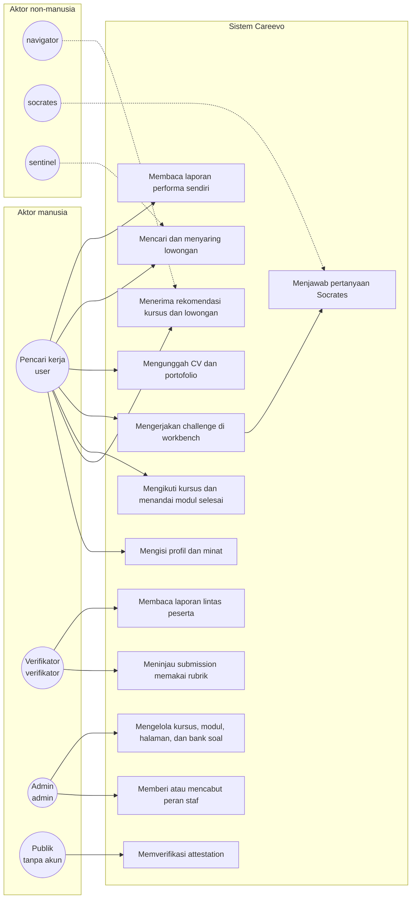
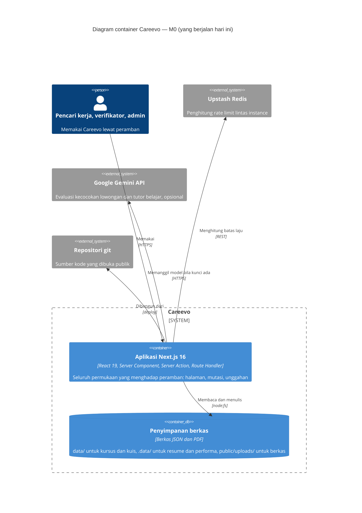
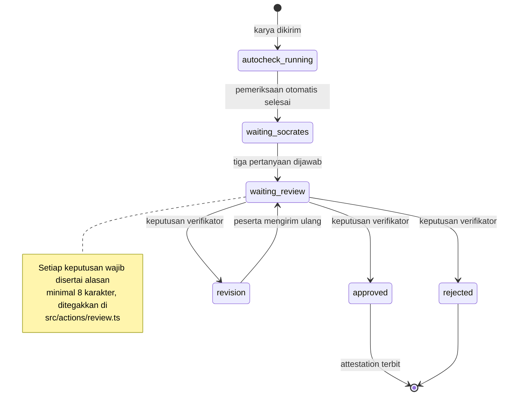
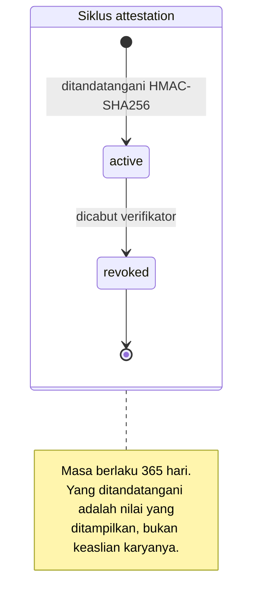
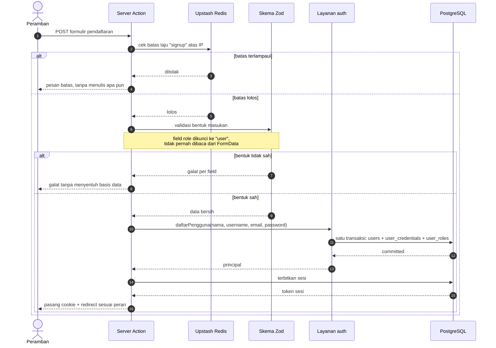
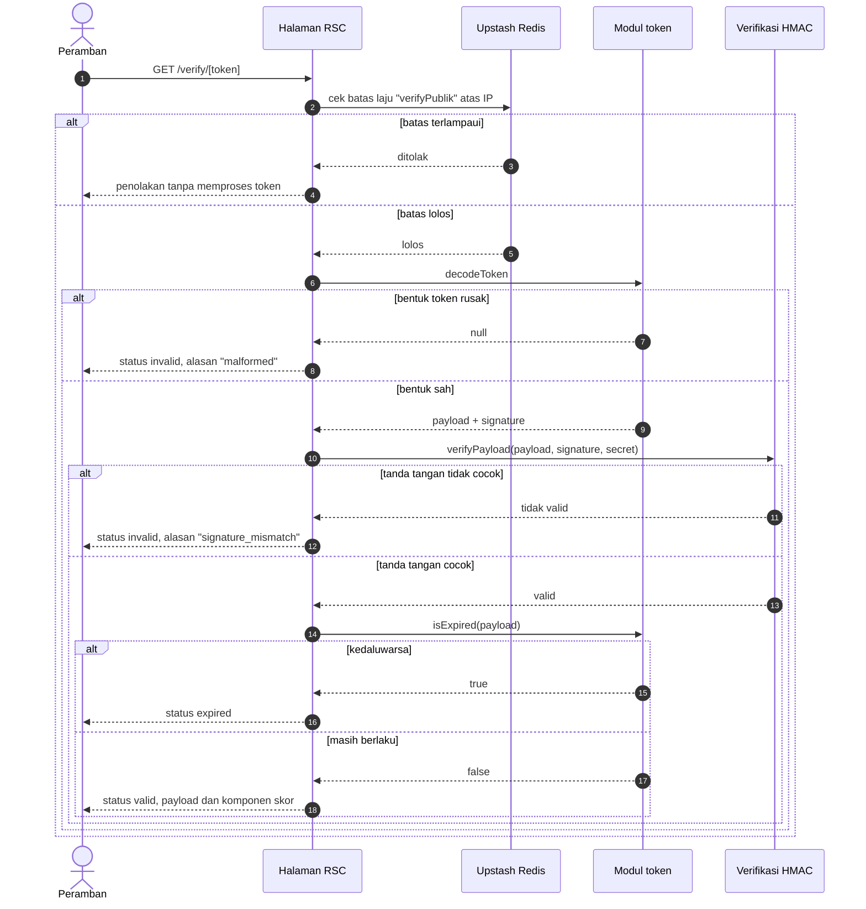
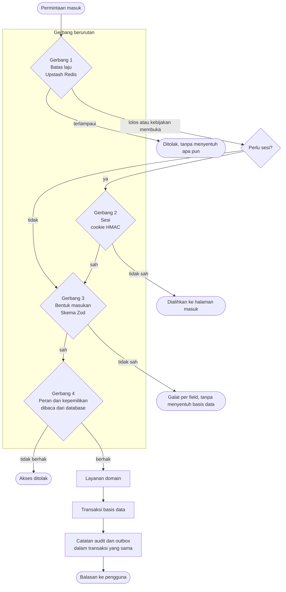

# Diagram Careevo — sumber Mermaid

Kumpulan diagram untuk proposal SWITCH Fest 2026. Semua ditulis sebagai **kode
Mermaid**, bukan berkas gambar, dengan tiga alasan: sumbernya ikut masuk repositori
yang wajib dibuka, ia bisa dirender ulang saat kode berubah, dan tidak ada berkas
biner yang harus dipercaya begitu saja.

Cara merender: tempel blok ```mermaid ke <https://mermaid.live>, atau biarkan
GitHub merendernya otomatis saat berkas ini dibuka di repositori.

**Semua diagram di sini menggambarkan yang ada di kode, bukan yang direncanakan.**
Bagian yang belum ada ditandai `[RENCANA]` di dalam diagram, dan tidak digambar
seolah sudah berjalan.

---

## 0. Dua keluarga diagram, jangan tertukar

Angka "7" yang sering disebut soal diagram pengembangan web sebenarnya menunjuk
pada dua keluarga berbeda yang masing-masing berjumlah tujuh.

**Keluarga 1 — UML 2.5, 14 diagram.** Tujuh struktural (class, object, package,
component, composite structure, deployment, profile) dan tujuh perilaku (use case,
activity, state machine, sequence, communication, interaction overview, timing).
Yang benar-benar dipakai di proposal perangkat lunak hanya empat: use case,
activity, state machine, dan sequence.

**Keluarga 2 — diagram praktik web, bukan UML.** ERD, DFD, C4 model, flowchart,
sitemap/IA, wireframe, dan user flow. Ini yang paling sering muncul di dokumen
pengembangan web, dan paling sering salah disebut "diagram UML".

| # | Diagram | Keluarga | Notasi | Berkas sumber |
|---|---|---|---|---|
| 1 | Use case | UML perilaku | Flowchart (Mermaid tidak punya tipe use case) | §1 |
| 2 | ERD | Praktik web | Crow's foot (`erDiagram`) | §2 |
| 3 | C4 container dan deployment | Praktik web | C4 (`C4Container`, `C4Deployment`) | §3 |
| 4 | State machine submission | UML perilaku | `stateDiagram-v2` | §4 |
| 5 | Sequence pendaftaran | UML perilaku | `sequenceDiagram` | §5 |
| 6 | Activity pipeline permintaan | UML perilaku | `flowchart` | §6 |
| 7 | Sitemap dan information architecture | Praktik web | `flowchart` | §7 |

Yang **tidak** dibuat, beserta alasannya: class, object, package, component,
composite structure, profile, communication, interaction overview, timing, dan
DFD. Kesepuluhnya menjawab pertanyaan yang tidak ditanyakan juri lomba web, dan
kehadirannya membuat dokumen terlihat seperti tugas kuliah.

Wireframe antarmuka tidak dibuat di sini karena ia harus berupa tangkapan layar
nyata, bukan sketsa. Daftarnya ada di §8.

---

## 1. Use case

Mermaid tidak punya tipe use case, jadi ia digambar sebagai flowchart dengan
aktor di kiri dan kanan. Aktornya diambil dari `ActorType` dan `AgentName` di
`src/types/domain.ts`, bukan dikarang.



**Catatan status.** UC2 dan UC5 dijalankan agen yang saat ini memakai template
tetap dan menandai dirinya `usedFallback: true`, bukan panggilan model atas kode
atau profil peserta. UC9 menghasilkan keputusan yang **belum tersimpan** ke basis
data, dan UC13 memverifikasi token yang sudah bisa diperiksa publik hari ini.
Ketiganya tetap digambar karena alurnya nyata; yang belum ada adalah bagian
penyimpanan dan panggilan modelnya.

---

## 2. ERD — 11 tabel

Digambar langsung dari `src/lib/db/schema.ts`, yang menurut kepala berkasnya
sendiri adalah satu-satunya sumber kebenaran untuk tabel PostgreSQL. Kolom
ditulis apa adanya, termasuk yang memperlihatkan keputusan keamanan: kata sandi
dipisah ke tabel sendiri, dan token selalu disimpan sebagai hash.

```mermaid
erDiagram
  users ||--o| user_profiles : "punya profil publik"
  users ||--o| user_credentials : "punya kredensial"
  users ||--o{ user_roles : "dipegang"
  users ||--o{ sessions : "punya sesi"
  users ||--o{ email_verification_tokens : "punya token"
  users ||--o{ password_reset_tokens : "punya token"
  users ||--o{ staff_invitations : "mengundang"
  users ||--o{ audit_events : "menjadi aktor"
  outbox_events ||--o{ outbox_deliveries : "dikirim ke sink"

  users {
    uuid id PK
    text email_normalized UK
    text username_normalized UK
    text display_name
    text status "active|suspended|deleted"
    timestamptz created_at
    timestamptz updated_at
  }

  user_profiles {
    uuid user_id PK
    text public_bio
    uuid avatar_file_id
    uuid cover_file_id
    timestamptz username_changed_at
    timestamptz updated_at
  }

  user_credentials {
    uuid user_id PK
    text password_hash "Argon2id, hanya di tabel ini"
    timestamptz password_changed_at
  }

  user_roles {
    uuid user_id PK
    text role PK "user|verifikator|admin"
    uuid granted_by_user_id FK
    timestamptz granted_at
    timestamptz revoked_at "revoke = UPDATE, bukan DELETE"
  }

  sessions {
    uuid id PK
    uuid user_id FK
    text token_hash UK "hash, bukan token asli"
    timestamptz created_at
    timestamptz expires_at
    timestamptz rotated_at
    timestamptz revoked_at
    text user_agent
    text ip_prefix "prefix saja, bukan IP penuh"
  }

  email_verification_tokens {
    uuid id PK
    uuid user_id FK
    text token_hash UK
    timestamptz expires_at
    timestamptz consumed_at
  }

  password_reset_tokens {
    uuid id PK
    uuid user_id FK
    text token_hash UK
    timestamptz expires_at
    timestamptz consumed_at
  }

  staff_invitations {
    uuid id PK
    text email_normalized
    text role "verifikator|admin"
    uuid invited_by_user_id FK
    text token_hash UK
    timestamptz expires_at
    timestamptz consumed_at
    timestamptz revoked_at
  }

  audit_events {
    bigserial id PK "append-only, urutan kronologis stabil"
    uuid actor_user_id FK
    text action
    text entity_type
    text entity_id
    jsonb payload_redacted "sudah disaring sebelum insert"
    text request_id
    timestamptz created_at
  }

  outbox_events {
    uuid id PK
    text type
    text aggregate_type
    text aggregate_id
    jsonb payload_redacted
    timestamptz occurred_at
    timestamptz available_at "backoff menggeser kolom ini"
    integer attempts
    text lease_owner
    timestamptz lease_expires_at
    timestamptz processed_at "sukses"
    text last_error_code
    timestamptz dead_lettered_at "gagal terminal"
    text idempotency_key UK
  }

  outbox_deliveries {
    uuid event_id PK
    text sink PK "email|audit|..."
    text status "in_progress|succeeded|failed"
    timestamptz updated_at
    timestamptz delivered_at
    text result_code
  }
```



**Tiga keputusan yang terlihat dari ERD ini, dan alasannya.**

`user_credentials` dipisah dari `users` bukan demi normalisasi melainkan demi
keamanan: query profil biasa tidak boleh pernah menyentuh hash kata sandi.

`user_roles` menyimpan peran sebagai baris, bukan kolom, supaya pemberian dan
pencabutan punya jejak sendiri. Karena primary key-nya komposit `(user_id, role)`,
memberi peran yang pernah dicabut harus meng-`UPDATE` baris lama, dan mencabut
peran adalah `UPDATE revoked_at`, bukan `DELETE` — menghapus barisnya akan
menghilangkan bukti siapa yang pernah memberi.

`outbox_deliveries` memakai primary key komposit `(event_id, sink)` karena yang
harus unik adalah pasangan event dan sink, bukan event saja. Claim event boleh
dilepas saat retry, jadi idempotensi tidak boleh bergantung padanya.

---

## 3. C4 container dan deployment

Judul aslinya "topologi deployment produksi", dan statusnya di ADR adalah
**diusulkan, belum disetujui**. Karena itu diagram ini memisahkan yang berjalan
sekarang dari yang belum, dan tidak menggambar VPS seolah sudah ada.



```mermaid
C4Deployment
  title Topologi target — VPS BELUM DIBELI, jalur Vercel ke VPS belum live

  Deployment_Node(browser, "Peramban pengguna", "Perangkat apa pun") {
    Container(spa, "Aplikasi web", "HTML, CSS, JavaScript")
  }

  Deployment_Node(vercel, "Vercel", "Runtime Node, region belum dipilih") {
    Container(app, "Aplikasi Next.js 16", "Node.js", "Seluruh permukaan yang menghadap peramban")
  }

  Deployment_Node(vps, "VPS — RENCANA, belum diprovision", "Satu node, SPOF yang diterima") {
    Container(api, "API internal", "Belum ada", "Hanya menerima koneksi terverifikasi")
    ContainerWorker(worker, "Worker outbox", "Belum ada", "Memproses outbox_events")
    ContainerDb(pg, "PostgreSQL", "Belum ada", "Identitas, peran, sesi, audit, outbox")
  }

  Deployment_Node(upstash, "Upstash Redis", "Dikelola, region belum dipilih") {
    ContainerDb(cache, "Penghitung rate limit", "Redis")
  }

  Rel(spa, app, "HTTPS", "TLS diterminasi di sini")
  Rel(app, pg, "BELUM LIVE — butuh amandemen ADR", "Hanya setelah trust boundary diverifikasi")
  Rel(app, cache, "Menghitung batas laju", "REST")
  Rel(worker, pg, "Meng-claim dan memproses event", "SQL")
```

**Catatan status.** Sesuai ADR 0001 §1.0, VPS belum dibeli, dan pada M0 Vercel
memegang seluruh permukaan yang menghadap peramban. Jalur Vercel ke VPS "belum
live", dan digambar di sini hanya supaya tidak diimprovisasi nanti. Aturan yang
mengikat saat boundary diaktifkan: VPS wajib memverifikasi asal permintaan
sebelum membaca header apa pun, termasuk header IP.

---

## 4. State machine — submission dan attestation

Digambar dari `SubmissionStatus`, `ReviewDecision`, dan `BadgeStatus` di
`src/types/domain.ts`, bukan dari rencana di dokumen, karena keduanya memakai
nama status yang berbeda.





**Catatan status.** Dokumen rencana memakai rantai status yang berbeda, yaitu
`draft → submitted → assigned → in_review → approved | rejected | changes_requested`
lalu `approved → attested → revoked`. Nama-nama itu **belum ada di kode**, jadi
yang digambar di sini adalah nama yang benar-benar dipakai `domain.ts`.

---

## 5. Sequence — pendaftaran dan verifikasi publik

Urutan pemeriksaan di diagram pertama diambil langsung dari `registerAction` di
`src/actions/auth.ts`, tempat batas laju dijalankan **sebelum** skema dan skema
dijalankan **sebelum** layanan basis data. Urutannya bukan kebetulan.





**Catatan.** Dua alasan penolakan yang berbeda itu disengaja, supaya token yang
salah ketik bisa dibedakan dari token yang dipalsukan. Halaman verifikasi tidak
memerlukan login, dan payload-nya tidak memuat surel, nomor identitas, maupun
foto.

---

## 6. Activity — pipeline permintaan

Menunjukkan urutan empat gerbang yang sama untuk setiap mutasi. Gambar ini
melengkapi Gambar 1 di proposal, dan dipakai kalau juri menanyakan urutannya.



**Catatan.** Peran dibaca dari basis data, bukan dari klaim di cookie. Sebelum
modul otorisasi dipusatkan, peran staf dibaca dari cookie sesi sehingga peran
yang dicabut tetap berlaku sampai cookie kedaluwarsa. Sekarang pencabutan
berlaku pada permintaan berikutnya.

---

## 7. Sitemap dan information architecture

Dibagi menurut enam kelompok route yang benar-benar ada di `src/app/`, beserta
gerbang akses masing-masing.

```mermaid
flowchart TD
  ROOT(["careevo"])

  ROOT --> MK["(marketing)<br/>terbuka"]
  ROOT --> PB["(public)<br/>terbuka"]
  ROOT --> OB["(onboarding)<br/>terbuka, gerbang di halaman"]
  ROOT --> AP["(app)<br/>sesi + profil lengkap"]
  ROOT --> FC["(focus)<br/>sesi + profil lengkap"]
  ROOT --> VK["(verifikator)<br/>sesi + peran staf"]

  MK --> MK1["/"]
  MK --> MK2["/careevo-plus"]

  PB --> PB1["/masuk"]
  PB --> PB2["/daftar"]
  PB --> PB3["/kerja"]
  PB --> PB4["/loker"]
  PB --> PB5["/explore/most-popular-courses"]
  PB --> PB6["/specializations/[slug]"]
  PB --> PB7["/professional-certificates/[slug]"]
  PB --> PB8["/p/[username]"]
  PB --> PB9["/verify/[token]"]
  PB --> PB10["route handler<br/>/p/[username]/berkas/[slot]"]

  OB --> OB1["/onboarding"]
  OB --> OB2["/onboarding/demo"]

  AP --> AP1["/dashboard"]
  AP --> AP2["/belajar"]
  AP --> AP3["/belajar/[slug]"]
  AP --> AP4["/belajar/jalur"]
  AP --> AP5["/pengaturan"]
  AP --> AP6["/profil"]
  AP --> AP7["/loker/[id]"]
  AP --> AP8["/submission/[id]"]

  FC --> FC1["/challenge/[id]"]

  VK --> VK1["/review dan /review/[id]"]
  VK --> VK2["/audit"]
  VK --> VK3["/performa dan /performa/[owner]"]
  VK --> VK4["/performa/integritas dan /[owner]"]
  VK --> VK5["/admin/courses dan /admin/courses/[id]"]
  VK --> VK6["/admin/kuis"]
```



Dua catatan yang penting supaya sitemap ini tidak salah dibaca.

Gerbang akses berada di berkas layout tiap kelompok, bukan di `middleware.ts`,
karena proyek ini tidak memakai middleware. Halaman yang membutuhkan sesi
memeriksanya kembali di dalam halamannya sendiri, sehingga melewatkan satu
gerbang tidak cukup untuk membuka akses.

`/p/[username]/berkas/[slot]` bukan halaman melainkan route handler yang
mengirim berkas PDF, karena isinya biner dan tidak dirender sebagai halaman.
Selain itu ada satu route handler lagi di luar sitemap ini, yaitu `POST
/api/unggah` untuk menerima berkas unggahan, dan satu route handler yang sama
juga memasang pembatas laju sebelum badannya dibuffer penuh.

---

## 8. Wireframe — daftar tangkapan layar yang harus diambil

Ini bukan diagram, melainkan daftar gambar yang harus diambil dari aplikasi yang
berjalan. Kriteria UI/UX bernilai 25 poin dari 100 di juknis, kriteria terbesar,
sehingga bagian ini tidak boleh dilewatkan.

| Gambar | Halaman | Yang harus terlihat |
|---|---|---|
| Gambar 3 | `/onboarding` dan `/dashboard` | Formulir minat dan hasil rekomendasi yang diturunkan dari profil |
| Gambar 4 | `/belajar/[slug]` | Halaman berformat, daftar isi yang diturunkan dari judul bagian, dan penanda progres |
| Gambar 5 | Workbench challenge | Editor, pratinjau, panel uji, rincian sinyal VTS, dan pertanyaan Socrates |
| Gambar 6 | `/verify/[token]` | Token sah dan token yang diubah satu karakter, berdampingan |
| Gambar 7 | `/loker` | Papan dengan tiga tingkat status dan detail lowongan terkarantina tanpa tombol melamar |

Aturan pengambilan yang dipegang: tangkapan layar tidak boleh mengklaim perilaku
yang tidak terlihat di gambar. Tombol yang belum berfungsi bukan bukti fungsi,
jadi tombol "Lamar sekarang" tidak boleh ditonjolkan sebagai bukti alur lamaran.

---

## 9. Berkas yang dirujuk

| Diagram | Sumber di kode |
|---|---|
| §1 Use case | `src/types/domain.ts` (`ActorType`, `AgentName`) |
| §2 ERD | `src/lib/db/schema.ts` |
| §3 C4 | `docs/adr/0001-topologi-deployment-produksi.md` |
| §4 State machine | `src/types/domain.ts` (`SubmissionStatus`, `BadgeStatus`, `ReviewDecision`) |
| §5 Sequence | `src/actions/auth.ts` (`registerAction`), `src/app/(public)/verify/[token]/page.tsx` |
| §6 Activity | `src/lib/auth/authorization.ts`, `src/lib/actions-common.ts` |
| §7 Sitemap | `src/app/` (enam kelompok route) |

Diagram ini tidak menggantikan berkas sumbernya. Kalau keduanya berbeda, yang
benar adalah kode, dan diagramnya yang harus diperbaiki.
